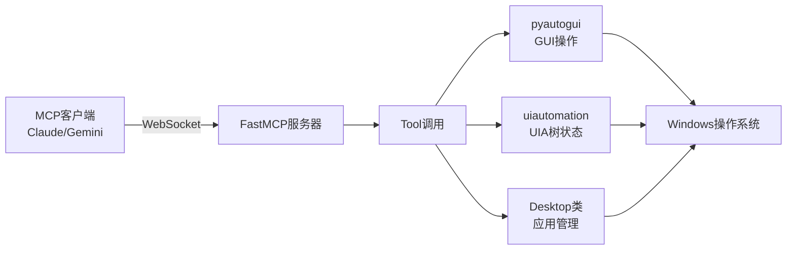

# Windows MCP 和 UFO 3.0 详细分析报告

生成时间：2025年12月3日

---

## 📋 目录
1. [项目概览](#项目概览)
2. [Windows MCP 详细分析](#windows-mcp-详细分析)
3. [UFO 3.0 详细分析](#ufo-30-详细分析)
4. [技术对比](#技术对比)
5. [应用场景建议](#应用场景建议)
6. [使用建议](#使用建议)

---

## 项目概览

### Windows MCP (v0.3)
- **位置**: `F:\github\电脑管理\Windows-MCP-0.3`
- **开发者**: CursorTouch / Jeomon George
- **授权**: MIT License
- **Python版本**: 3.13+
- **核心**: 基于 MCP (Model Context Protocol) 的轻量级 Windows 自动化服务器

### UFO 3.0.0
- **位置**: `F:\github\电脑管理\UFO-3.0.0`
- **开发者**: Microsoft Research
- **授权**: MIT License
- **Python版本**: 3.10/3.11
- **核心**: 包含 **UFO² (桌面智能体操作系统)** + **Galaxy (多设备编排框架)**

---

## Windows MCP 详细分析

### 🎯 核心定位
**轻量级 MCP 服务器**，作为 AI Agent 与 Windows 操作系统之间的桥梁，支持 Claude Desktop、Gemini CLI 等 MCP 客户端。

### 📦 项目结构
```
Windows-MCP-0.3/
├── main.py              # 主服务器入口 (258行)
├── src/
│   ├── desktop/         # 桌面操作核心
│   │   ├── config.py
│   │   └── views.py
│   └── tree/            # UI树状态管理
│       ├── config.py
│       ├── utils.py
│       └── views.py
├── assets/              # 资源文件
├── pyproject.toml       # 项目配置
└── README.md
```

### 🛠️ 核心工具集 (13个工具)

#### 1. **Launch-Tool** - 启动应用
```python
def launch_tool(name: str) -> str
```
从开始菜单启动应用程序（如"notepad"、"calculator"）

#### 2. **State-Tool** - 获取桌面状态 ⭐ **最重要**
```python
def state_tool(use_vision: bool=False) -> str
```
- 获取当前桌面完整状态
- 包含焦点应用、打开的应用列表
- 交互元素（按钮、输入框、菜单）
- 信息元素（文本、标签）
- 可滚动区域
- 可选：视觉截图

#### 3. **Click-Tool** - 鼠标点击
```python
def click_tool(loc: list[int], button: Literal['left','right','middle']='left', clicks: int=1)
```
支持左/右/中键，单击/双击/三击

#### 4. **Type-Tool** - 文本输入
```python
def type_tool(loc: list[int], text: str, clear: bool=False, press_enter: bool=False)
```
- 智能处理中文等非ASCII字符（通过剪贴板）
- 可选清空现有文本
- 可选自动按回车

#### 5. **Clipboard-Tool** - 剪贴板操作
```python
def clipboard_tool(mode: Literal['copy', 'paste'], text: str = None)
```

#### 6. **Scroll-Tool** - 滚动操作
```python
def scroll_tool(loc: list[int]=None, type: Literal['horizontal','vertical']='vertical', 
                direction: Literal['up','down','left','right']='down', wheel_times: int=1)
```

#### 7. **Drag-Tool** - 拖拽操作
```python
def drag_tool(from_loc: list[int], to_loc: list[int])
```

#### 8. **Move-Tool** - 移动鼠标
```python
def move_tool(to_loc: list[int])
```

#### 9. **Shortcut-Tool** - 快捷键
```python
def shortcut_tool(shortcut: list[str])
```
例如：`["ctrl", "c"]`、`["alt", "tab"]`、`["win", "r"]`

#### 10. **Key-Tool** - 单键按下
```python
def key_tool(key: str='')
```
支持特殊键："enter"、"escape"、"tab"、"space"、"backspace"、"delete"、方向键、F1-F12

#### 11. **Wait-Tool** - 等待
```python
def wait_tool(duration: int)
```

#### 12. **Resize-Tool** - 调整窗口大小/位置
```python
def resize_tool(name: str, size: list[int]=None, loc: list[int]=None)
```

#### 13. **Switch-Tool** - 切换窗口
```python
def switch_tool(name: str)
```

#### 14. **Powershell-Tool** - 执行PowerShell命令 ⚠️ **强大但需谨慎**
```python
def powershell_tool(command: str)
```

#### 15. **Scrape-Tool** - 网页抓取
```python
def scrape_tool(url: str)
```
抓取网页内容并转换为 Markdown 格式

### 🔧 技术依赖

```toml
[dependencies]
fastmcp>=2.8.1           # MCP服务器框架
humancursor>=1.1.5       # 人类风格的鼠标移动
live-inspect>=0.1.1      # 实时监控光标
markdownify>=1.1.0       # HTML转Markdown
pyautogui>=0.9.54        # 自动化GUI操作
uiautomation>=2.0.24     # Windows UI Automation
fuzzywuzzy>=0.18.0       # 模糊字符串匹配
psutil>=7.0.0            # 系统进程管理
```

### 🌟 核心特点

1. **轻量级** - 仅8个核心Python文件
2. **快速响应** - 典型操作延迟 0.7-2.5秒
3. **MCP标准** - 兼容所有MCP客户端
4. **中文支持** - 智能处理非ASCII字符输入
5. **UI Automation** - 基于 Windows UIA (a11y tree)
6. **无需视觉模型** - 不依赖计算机视觉或特定微调模型

### 📊 工作原理



### ⚠️ 限制

1. **文本选择** - 无法选择段落中的特定部分（依赖 a11y tree）
2. **IDE编程** - `Type-Tool` 不适合在IDE中编写程序（会一次性输入整个文件）
3. **语言要求** - `Launch-Tool` 和 `Resize-Tool` 需要英文作为默认Windows语言，否则需禁用

---

## UFO 3.0 详细分析

### 🎯 核心定位
**多层次 Windows 自动化平台**：
- **UFO² (Desktop AgentOS)**: 单设备 Windows 智能体操作系统（稳定 LTS 版本）
- **Galaxy 框架**: 多设备编排框架（积极开发中）

### 📦 项目结构

```
UFO-3.0.0/
├── ufo/                  # UFO² 桌面智能体操作系统
│   ├── agents/           # Host/App智能体
│   ├── automator/        # 自动化执行器
│   ├── llm/              # 支持多种LLM
│   ├── rag/              # 知识检索增强
│   ├── client/           # 客户端接口
│   ├── server/           # WebSocket服务器
│   └── ufo.py            # 主入口
├── galaxy/               # Galaxy多设备编排框架
│   ├── constellation/    # 任务星座DAG
│   ├── orchestrator/     # 任务编排器
│   └── webui/            # Web界面
├── dataflow/             # 数据流管理
├── learner/              # 学习模块
├── record_processor/     # 记录处理
├── vectordb/             # 向量数据库
├── config/               # 配置文件
└── requirements.txt
```

### 🌟 UFO² (Desktop AgentOS) 核心特性

#### 1. **深度 Windows 集成**
- **UI Automation (UIA)**: 访问 Windows 可访问性树
- **Win32 API**: 底层系统调用
- **WinCOM**: COM组件交互
- **混合GUI+API**: 智能选择最优操作方式

#### 2. **双智能体架构**

```
用户请求
   ↓
HostAgent (主智能体)
   ↓
分配任务 → AppAgent1 (Excel)
         → AppAgent2 (Word)
         → AppAgent3 (Browser)
```

- **HostAgent**: 全局协调，任务分配
- **AppAgent**: 特定应用程序专家

#### 3. **推测性多操作** ⚡ **性能突破**
- 批量预测下一步操作
- **减少 51% 的 LLM 调用次数**
- 提高执行效率

#### 4. **混合控件检测**
- **视觉检测** + **UIA检测**
- 增强鲁棒性和准确性

#### 5. **RAG 知识增强**
- 文档索引
- 演示学习
- 执行轨迹记忆

#### 6. **多LLM支持** 🤖
支持的模型：
- OpenAI (GPT-4, GPT-4o)
- Azure OpenAI
- Claude (Anthropic)
- Gemini (Google)
- Qwen (阿里)
- DeepSeek
- Ollama (本地模型)
- LLaVA
- CogAgent

### 🌌 Galaxy 框架核心特性

#### 1. **TaskConstellation (任务星座)** - 核心创新 ⭐

```python
# 用户请求
"从 Windows 的 Excel 收集数据，在 Linux 上分析，在 Mac 上可视化"

# 转换为 DAG
        ┌─────────┐
        │ Task 1  │ Windows: Excel数据提取
        └────┬────┘
             │
        ┌────▼────┐
        │ Task 2  │ Linux: 数据分析
        └────┬────┘
             │
        ┌────▼────┐
        │ Task 3  │ Mac: 数据可视化
        └─────────┘
```

#### 2. **ConstellationAgent (星座智能体)**
- 智能任务分解
- 生成可执行 DAG 工作流
- 依赖关系分析

#### 3. **动态设备分配**
基于能力的智能匹配：
- 平台兼容性
- 资源可用性
- 任务要求
- 性能历史

#### 4. **事件驱动架构**
- 实时监控
- 观察者模式
- 动态工作流调整
- 自动错误恢复

#### 5. **支持的平台**
- ✅ Windows (通过 UFO²)
- ✅ Linux (Shell命令)
- ✅ macOS (Shell命令)
- ✅ Android
- ✅ Web

### 🔧 技术栈

```txt
# 核心依赖
openai==1.66.2              # LLM接口
langchain==0.3.27           # LLM链式调用
faiss-cpu==1.8.0            # 向量检索
sentence-transformers==2.6.0 # 文本嵌入

# Windows自动化
pywin32>=310                # Windows API
pywinauto==0.6.8            # Windows UI自动化
uiautomation==2.0.18        # UI自动化
pyautogui==0.9.54           # 跨平台GUI自动化

# Web服务
fastapi==0.116.1            # API服务器
websockets==12.0            # WebSocket通信
gradio_client==1.12.1       # Gradio界面

# MCP支持
fastmcp==2.11.3             # MCP服务器框架
anthropic==0.64.0           # Claude集成
```

### 📊 UFO² vs Galaxy 对比

| 维度 | UFO² Desktop AgentOS | Galaxy 框架 |
|-----|---------------------|------------|
| **定位** | 单设备 Windows 自动化 | 多设备编排框架 |
| **任务模型** | 顺序 ReAct 循环 | 并行 DAG 工作流 |
| **设备支持** | Windows 单机 | 多平台（Win/Linux/Mac/Android） |
| **架构** | HostAgent + AppAgents | ConstellationAgent + TaskOrchestrator |
| **执行方式** | 顺序执行 | 并行 DAG 执行 |
| **复杂度** | 简单到中等 | 中等到非常复杂 |
| **状态** | ✅ LTS (长期支持) | 🚧 积极开发中 |
| **学习曲线** | ⭐⭐⭐⭐⭐ 简单 | ⭐⭐⭐ 中等 |
| **生产就绪** | ✅ 稳定 | ⚠️ 实验性 |

### 🎯 UFO² 适用场景

✅ **推荐使用：**
- Excel/Word/PowerPoint 自动化
- 浏览器自动化 (Edge, Chrome)
- 文件系统操作
- Windows 系统配置
- 学习 AI Agent 开发
- 快速简单的任务
- 生产关键工作流

**示例：**
```
✓ "在 Excel 中创建月度销售报告"
✓ "搜索研究论文并保存 PDF"
✓ "按文件类型整理下载文件夹"
✓ "在 Access 数据库中更新产品目录"
```

### 🌌 Galaxy 适用场景

✅ **推荐使用：**
- 跨设备协作工作流
- 复杂数据管道 (ETL)
- 并行任务执行
- 跨平台编排
- 可扩展自动化
- 自适应工作流

**示例：**
```
✓ "从 Windows Excel 提取数据，在 Linux 服务器处理，在 Mac 上可视化"
✓ "在 Windows 运行测试，部署到 Linux 生产环境，更新移动应用"
✓ "跨异构计算资源的分布式数据处理"
✓ "多设备 IoT 编排和监控"
```

---

## 技术对比

### Windows MCP vs UFO²

| 维度 | Windows MCP | UFO² |
|-----|------------|------|
| **定位** | MCP 服务器 / AI工具集 | 智能体操作系统 |
| **复杂度** | ⭐ 简单 | ⭐⭐⭐⭐ 复杂 |
| **代码规模** | ~260行核心代码 | 数千行代码 |
| **智能性** | 工具调用（需外部AI） | 内置智能体（自主决策） |
| **学习曲线** | ⭐⭐⭐⭐⭐ 非常简单 | ⭐⭐⭐ 中等 |
| **扩展性** | ⭐⭐⭐ 中等 | ⭐⭐⭐⭐⭐ 极强 |
| **RAG支持** | ❌ 无 | ✅ 内置 |
| **多LLM** | ✅ (通过MCP客户端) | ✅ 原生支持多种 |
| **运行方式** | 后台服务器 | 命令行/服务器 |
| **依赖包数量** | ~10个 | ~40个 |

### 核心技术对比

#### 1. **UI 元素获取**

**Windows MCP:**
```python
# 使用 uiautomation 获取 UI 树
desktop_state = desktop.get_state(use_vision=False)
interactive_elements = desktop_state.tree_state.interactive_elements_to_string()
```

**UFO²:**
```python
# 混合方法：UIA + 视觉检测
control_tree = get_control_tree(depth=3)
visual_controls = vision_detector.detect(screenshot)
merged_controls = merge_controls(control_tree, visual_controls)
```

#### 2. **操作执行**

**Windows MCP:**
```python
# 直接 GUI 操作
pg.click(x=x, y=y, button=button, clicks=clicks)
pg.typewrite(text, interval=0.1)
```

**UFO²:**
```python
# 智能选择操作方式
if can_use_api:
    app.api_call(action)  # API 优先
else:
    automator.gui_action(action)  # GUI 备选
```

#### 3. **文本输入（中文支持）**

两者都使用剪贴板方案处理非ASCII字符：

**Windows MCP:**
```python
if any(ord(char) > 127 for char in text):
    original_clipboard = pc.paste()
    pc.copy(text)
    pg.hotkey('ctrl','v')
    pc.copy(original_clipboard)  # 恢复剪贴板
```

**UFO²:**
```python
# 类似的实现，但有更完善的错误处理
```

---

## 应用场景建议

### 🎯 场景1: 简单桌面自动化
**需求:** 自动化 Excel 报表、文件整理、简单脚本

**推荐:** **Windows MCP** ⭐
- 轻量级，快速部署
- 配合 Claude Desktop 使用
- 学习成本低

### 🎯 场景2: 复杂 Windows 工作流
**需求:** 多应用协作、复杂任务链、需要上下文记忆

**推荐:** **UFO²** ⭐⭐⭐
- 智能任务分解
- RAG 知识增强
- 推测性多操作
- 稳定可靠（LTS）

### 🎯 场景3: 跨设备编排
**需求:** Windows + Linux + Mac 协作、分布式任务

**推荐:** **UFO³ Galaxy** ⭐⭐⭐⭐⭐
- 多设备 DAG 编排
- 动态设备分配
- 并行执行

### 🎯 场景4: AI Assistant 开发
**需求:** 为 Claude/Gemini 添加 Windows 控制能力

**推荐:** **Windows MCP** ⭐⭐⭐⭐⭐
- 标准 MCP 协议
- 即插即用
- 与 Claude Desktop 完美集成

### 🎯 场景5: 研究和学习
**需求:** 学习 GUI Agent、多智能体系统

**推荐:** **UFO²** (基础) → **Galaxy** (进阶)
- 完整的研究论文支持
- Microsoft Research 背书
- 丰富的文档和示例

---

## 使用建议

### 🚀 快速上手路径

#### 路径1: 从零开始（推荐新手）

```bash
# 第一步：Windows MCP (最简单)
cd F:\github\电脑管理\Windows-MCP-0.3
pip install uv
uv run main.py

# 安装 Claude Desktop，配置 MCP 服务器
# 开始使用！

# 第二步：熟悉后尝试 UFO²
cd F:\github\电脑管理\UFO-3.0.0
pip install -r requirements.txt
python -m ufo --task <your_task>

# 第三步：高级需求时使用 Galaxy
python -m galaxy --interactive
```

#### 路径2: 有经验的开发者

```bash
# 直接上手 UFO²
cd F:\github\电脑管理\UFO-3.0.0
pip install -r requirements.txt

# 配置 LLM
cp config/ufo/agents.yaml.template config/ufo/agents.yaml
# 编辑 agents.yaml，添加 API Key

# 运行
python -m ufo --task "your complex task"

# 需要多设备时
python -m galaxy --interactive
```

### 📋 配置检查清单

#### Windows MCP 配置
- [ ] Python 3.13+ 已安装
- [ ] 运行 `pip install uv`
- [ ] 安装 Claude Desktop 或 Gemini CLI
- [ ] Windows 默认语言设为英文（或禁用 Launch/Resize 工具）
- [ ] 配置 MCP 客户端的 settings.json

#### UFO² 配置
- [ ] Python 3.10/3.11 已安装
- [ ] 运行 `pip install -r requirements.txt`
- [ ] 复制并编辑 `config/ufo/agents.yaml`
- [ ] 添加 LLM API Key
- [ ] (可选) 配置 RAG 向量数据库

#### Galaxy 配置
- [ ] UFO² 已配置
- [ ] 复制并编辑 `config/galaxy/agent.yaml`
- [ ] 启动设备智能体（Windows/Linux/Mac）
- [ ] 配置设备池管理器

### ⚠️ 注意事项

1. **Windows MCP**
   - ⚠️ 直接操作系统，谨慎使用
   - ⚠️ `Powershell-Tool` 有安全风险
   - ⚠️ 在生产环境前充分测试

2. **UFO²**
   - ⚠️ 首次运行可能需要较长时间加载模型
   - ⚠️ 注意 API 调用成本（LLM 调用）
   - ⚠️ 推测性多操作可能出错，需要错误处理

3. **Galaxy**
   - ⚠️ 仍在积极开发中，API 可能变化
   - ⚠️ 多设备协调复杂度高
   - ⚠️ 建议先在测试环境验证

### 💡 最佳实践

1. **Windows MCP**
   ```python
   # 总是先获取状态
   state = state_tool(use_vision=False)
   
   # 然后再操作
   click_tool(loc=[100, 200])
   ```

2. **UFO²**
   ```python
   # 启用 RAG 提高准确性
   # 在 config/ufo/agents.yaml 中设置
   RAG_ONLINE_SEARCH: True
   RAG_DEMONSTRATION: True
   
   # 使用推测性多操作
   MULTI_ACTION_ENABLED: True
   ```

3. **Galaxy**
   ```python
   # 明确任务依赖关系
   "First extract data from Excel on Windows,
    then analyze on Linux,
    finally visualize on Mac"
   
   # Galaxy 会自动生成 DAG 并分配设备
   ```

---

## 🎓 学习资源

### Windows MCP
- 📖 README: `F:\github\电脑管理\Windows-MCP-0.3\README.md`
- 🌐 GitHub: https://github.com/CursorTouch/Windows-MCP
- 📹 Demo视频: README中的演示链接
- 📝 贡献指南: `CONTRIBUTING.md`

### UFO 3.0
- 📖 中文文档: `F:\github\电脑管理\UFO-3.0.0\README_ZH.md`
- 📖 UFO² 文档: `ufo/README_ZH.md`
- 📖 Galaxy 文档: `galaxy/README_ZH.md`
- 🌐 在线文档: https://microsoft.github.io/UFO/
- 📄 论文: 
  - UFO (2024): arXiv:2402.07939
  - UFO² (2025): arXiv:2504.14603
  - UFO³ Galaxy (2025): 即将发布
- 📧 邮件: ufo-agent@microsoft.com

---

## 🔮 未来展望

### Windows MCP
- ✅ 稳定版本，持续维护
- 🔜 增强 DXT (Desktop Extension) 支持
- 🔜 更多 MCP 客户端集成

### UFO²
- ✅ 进入 LTS (长期支持) 状态
- ✅ 作为 Galaxy 的 Windows 设备智能体
- 🔜 增强设备智能体功能
- 🔜 画中画桌面模式

### Galaxy
- ✅ 核心框架已完成
- 🔄 高级设备类型（进行中）
- 🔄 增强可视化（进行中）
- 🔄 性能优化（进行中）
- 🔜 容错性增强
- 🔜 跨设备数据流优化
- 🔜 自动调试工具包

---

## 📊 总结对比表

| 特性 | Windows MCP | UFO² | Galaxy |
|-----|------------|------|--------|
| **代码复杂度** | ⭐ 极简 | ⭐⭐⭐⭐ 复杂 | ⭐⭐⭐⭐⭐ 非常复杂 |
| **部署难度** | ⭐⭐⭐⭐⭐ 简单 | ⭐⭐⭐⭐ 中等 | ⭐⭐⭐ 较难 |
| **功能强大度** | ⭐⭐⭐ 基础 | ⭐⭐⭐⭐⭐ 强大 | ⭐⭐⭐⭐⭐ 极强 |
| **稳定性** | ⭐⭐⭐⭐ 稳定 | ⭐⭐⭐⭐⭐ 非常稳定 | ⭐⭐⭐ 开发中 |
| **文档质量** | ⭐⭐⭐⭐ 清晰 | ⭐⭐⭐⭐⭐ 完善 | ⭐⭐⭐⭐ 详细 |
| **社区支持** | ⭐⭐⭐ 增长中 | ⭐⭐⭐⭐⭐ 活跃 | ⭐⭐⭐ 增长中 |
| **学习成本** | 1-2小时 | 1-2天 | 3-5天 |
| **适用范围** | 工具集成 | Windows自动化 | 跨平台编排 |

---

## 🎯 我的建议

基于你的当前情况，我建议：

### 第一阶段：熟悉基础 (1-2周)
1. **从 Windows MCP 开始**
   - 配置 Claude Desktop
   - 尝试简单的自动化任务
   - 理解 MCP 协议

### 第二阶段：深入学习 (2-4周)
2. **探索 UFO²**
   - 运行示例任务
   - 理解 HostAgent + AppAgent 架构
   - 尝试 RAG 增强
   - 实验推测性多操作

### 第三阶段：高级应用 (按需)
3. **Galaxy（如果需要跨设备）**
   - 理解任务星座概念
   - 配置多设备环境
   - 实验跨平台工作流

---

## 📞 需要帮助？

如果你在使用过程中遇到问题：

1. **Windows MCP**
   - 检查日志
   - 查看 GitHub Issues
   - Discord 社区支持

2. **UFO 3.0**
   - 查看详细文档: https://microsoft.github.io/UFO/
   - GitHub Discussions
   - 邮件: ufo-agent@microsoft.com

3. **我可以帮你**
   - 配置文件编写
   - 错误排查
   - 自定义开发
   - 集成到现有项目

---

**报告结束**

祝你使用愉快！🚀
